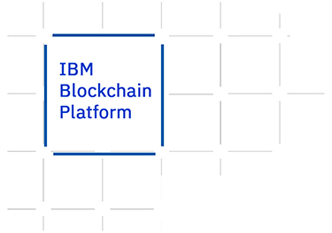

# Hands-on Blockchain - ORT - Día 2

En este repositorio encontrará los pasos para el Hands-on de Blockchain! Podremos llevar a la práctica varios de los conceptos que vimos en la introducción teórica al comienzo del taller.


<p align="center">
  
</p>

## Introducción

En la segunda etapa del taller trabajaremos con dos casos de usos independientes. El primero será una red de fidelización de clientes que se ejecutará de forma local y el segundo ejemplo se tratará de una aplicación de votación en la que la red estará desplegada en la nube de IBM.

## Lab 2


En este laboratorio generaremos un smart contract a partir de un código ya elaborado y más complejo.


En la carpeta *code* de este repositorio encontrará dos carpetas, *web-app* y *contract*. Dentro de la primera se encuentra una estructura de front-end y otra de back-end para poder operar nuestra red utilizando una webapp. Dentro de la segunda carpeta, *contract*, se encuentra el código para generar nuestro smart contract. 


### Caso de aplicación


Los programas de fidelización de clientes permiten a las empresas recompensar a los clientes que realizan compras con frecuencia. Los miembros del programa ganan puntos en compras, que se traducen en algún tipo de recompensa, como un descuento, un obsequio, etc. Los miembros trabajan para obtener una cierta cantidad de puntos para canjear recompensas. Estos programas pueden tener múltiples empresas como partners para atender a una base de clientes. Sin embargo, los sistemas actuales del programa de fidelización restringen las relaciones entre los partners y pueden dificultar la visibilidad de los miembros. Estas restricciones se pueden eliminar creando el programa de fidelización del cliente en una red blockchain. Este modelo de blockchain para un programa de fidelización de clientes mejora el valor de los puntos para los miembros del programa de fidelización y brinda un nuevo valor a los partners con transacciones confiables.


La aplicación permite a los miembros registrarse en la red para que estos creen sus cuentas. Se identifican en la red con sus números de cuenta y crean una clave de acceso, la cual utilizan para iniciar sesión. Esta clave de acceso se utiliza como ID de tarjeta para realizar transacciones y consultar registros. Un miembro, una vez que haya iniciado sesión, puede realizar transacciones para ganar y canjear puntos de los socios en la red. Pueden ver sus transacciones como parte del ledger de blockchain. 


De manera similar para los partners, se registran creando su id en la red y obtienen claves de acceso para ver sus registros. Los socios pueden ver solo las transacciones de las que formaron parte y así puedan realizar un seguimiento de todas sus transacciones donde asignaron o canjearon puntos.


### Flujo


<p align="center">
  
</p>


### Objetivos


* Empaquetar el Smart Contract
* Configurar la red local y desplegar el Smart Contract
* Correr la aplicación


### Empaquetar el Smart Contract


Ingresamos Visual Studio Code y abrimos la carpeta **contract** que se encuentra en el directorio _code/lab2_.


Una vez que tenemos abierta la carpeta, haga clic en el icono **IBM Blockchain Platform** en la barra lateral izquierda. 


En la sección de _Smart Contracts_ presionamos el botón con tres puntos para obtener opciones. Luego, seleccionamos **Package Open Project**.\
Se creará un nuevo Smart Contract bajo el nombre de _customerloyalty@1.0.0_.\
Ahora que tenemos ese recurso, hacemos click derecho sobre el mismo y seleccionamos la opción **Export Package**. Elegimos el directorio de nuestra preferencia y exportamos el contrato. (Importante acordarse de este directorio, ya que se utilizará luego)


### Configurar la red local y desplegar el Smart Contract


Para poder configurar la red local, hacemos click en el botón con tres puntos en la sección _Local Fabric Ops_ y seleccionamos la opción **Start Fabric Runtime**. Cuando termine de correr, podremos ver diferentes elementos en la sección. Dentro de la misma, hacemos click en el botón **+ Install**, que se encuentra dentro de _Local Fabric Ops >> Smart Contracts >> Installed_, y seleccionamos el contrato **customerloyalty@1.0.0**.\
Luego, hacemos click en el botón **+ Instantiate**, que se encuentra dentro de _Local Fabric Ops >> Smart Contracts >> Instantiated_, y seleccionamos el contrato **customerloyalty@1.0.0**. Ingresamos como nombre _instantiate_ como función y presionamos **Enter**. Estos pasos instalarán e instanciarán el Smart Contract dentro de nuestra red.


### Correr la aplicación


Ahora que tenemos el Smart Contract desplegado en nuestra red, lo único que falta es correr la aplicación.\
Abrimos un terminal nueva y nos movemos hasta la carpeta web-app, que se encuentra en _code/lab2_. Luego ejecutamos el siguiente comando para instalar las dependencias:


```
npm install
```


Luego, en la misma terminal, ejecutamos el archivo enrollAdmin.js que nos permite acceder con nuestras credenciales a la red:


```
node enrollAdmin.js
```


Nos tendría que aparecer el mensaje: _msg: Successfully enrolled admin user admin and imported it into the wallet_.\
Por último, para correr la aplicación ejecutamos:


```
npm start
```


La aplicación quedará corriendo en [http://localhost:8000](http://localhost:8000)


## Lab 3


<p align="center">
  
</p>


En esta ultima oportunidad lo que haremos sera simular una plataforma de voto electrónico para las elecciones nacionales de octubre. Para generar la red usamos IBM Blockchain Platform en la nube y luego desde cada pc se podrá acceder a la red por medio de una webapp (*/code/lab3*) que ya contiene la configuración y las credenciales para dicha conexión. Esto permitirá que cada uno pueda usar la app para registrarse como votante, emitir votos, ver las transacciones de otros usuarios y los resultados de la votación.


### Flujo


<p align="center">
  
</p>

### Ejecutar la aplicación


Tenemos que ejecutar el backend y el frontend por separado, por lo tanto abarcamos dos terminales, en la primera vayamos a la carpeta  */code/lab3/server* e instalamos las librerías de node:


```
npm install
```


Luego ejecutamos el archivo *enrollAdmin.js* para conectarnos en la red. Este archivo ya cuenta con las credenciales para acceder a la red:


```
node enrollAdmin.js
```


Deberemos de recibir un mensaje como el siguiente:


```
msg: Successfully enrolled admin user app-admin and imported it into the wallet
```


Ahora podemos iniciar el servidor:


```
npm start
```


En la otra terminal (y sin cerrar esta), vayamos a la carpeta */code/lab3/client*


Alli ejecutamos:


```
npm install
```
 Y luego :


 ```
npm run serve
 ```


 Ya podemos ingresar a [https://localhost:8080](https://localhost:8080) para acceder a la plataforma de votación electrónica. 


### Registrarse en la red


 Primero, necesitamos registrarnos como votantes y crear nuestro id con el cual enviaremos nuestro voto. Para hacer esto, necesitaremos ingresar un ID único (cédula de identidad) junto con nuestra credencial y nuestros nombres y apellidos (Para el propósito de esta demo cualquier valor ingresado es valido).


Si todo va bien, debería ver 
```
voter with voterId {} is updated in the world state. Use voterId to login above. 
```
**Nota:** en el primer intento, la aplicación puede tardar un segundo en iniciarse. Si hace clic en registrase y no sucede nada, vuelva a intentar completar el formulario y haga clic en registrarse nuevamente.


Note ahora que dentro de */code/lab3/server/* tendrá una carpeta nueva llamada *wallet* donde allí se almacenan las credenciales de su billetera, debería tener la de admin y también la del usuario que acaba de registrar. Esto significa que el usuario está registrado en la red y que solo usted puede acceder a emitir un voto ya que es quien posee las credenciales del mismo. En caso que le envié esas credenciales a alguien y esta persona las coloque en su *wallet*, esta persona podrá acceder a la plataforma con su usuario. 


### Realizar un voto


A continuación, podemos iniciar sesión en la aplicación con nuestra cédula de identidad. 


Una vez que iniciamos sesión, podemos emitir nuestro voto. Utilizaremos nuestro cedula de votacion como id para emitir nuestro voto. Como estamos votando por las elecciones presidenciales para octubre de 2019, podemos elegir el candidato que querramos. Una vez que hayamos terminado, podemos hacer clic en *votar*, y luego se emite nuestro voto. 


### Ver resultados y Transacciones


En la pestaña *Resultados* podemos consultar por el total de los votos obtenidos por cada candidato. Desde la pestaña *Ver Transacciones* Podemos ver todas las las transacciones de que realizaron cambios en nuestro ledger.
